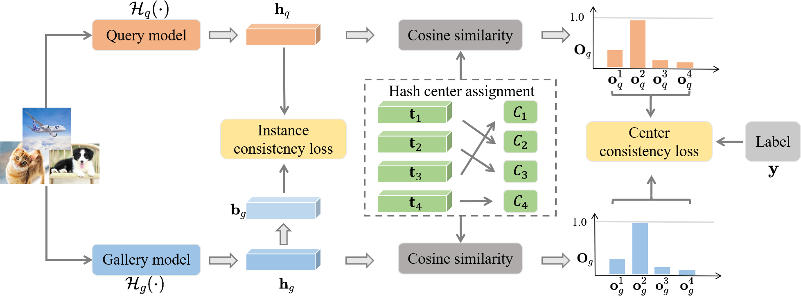

# CSCH
Official Pytorch implementation of "Central Similarity Consistency Hashing for Asymmetric Image Retrieval"

## Overall training procedure of CSCH

<p align="center"></p>

## Train CSCH models
### Prepare datasets
We use public benchmark datasets: CIFAR-10, ImageNet, MS COCO. 
Image file name and corresponding labels are provided in ```./data```.

Datasets can be downloaded here:
<a href="https://github.com/swuxyj/DeepHash-pytorch">ImageNet and MS-COCO</a>

### Training
```bash
python main.py --codebook-method O --ds imagenet100 --margin 0.2 --epochs 150 --assignment True --device 0 --arch_top mobilenetv3 --arch_bottom resnet50 --nbit 32 --bs 64 --gamma 10 
```
## Acknowledgement
This code inherits some codes from <a href="https://github.com/kamwoh/orthohash">OrthoHash</a>
